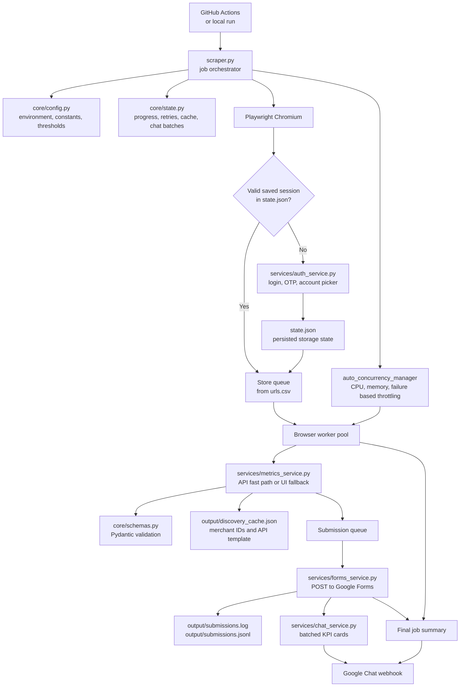
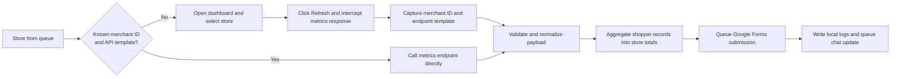

# Amazon 1MMS Dashboard Scraper


This project is a headless, scheduled data pipeline for Amazon Seller Central.
It logs into the 1MMS account, collects store-level performance metrics, normalizes the raw payloads, submits the results to Google Forms, and posts operational summaries to Google Chat.

The main runtime is [`scraper.py`](./scraper.py). The scraper is optimized around three goals:

- reuse auth state so repeated runs do not re-login unless needed
- prefer direct API collection over UI scraping whenever possible
- keep throughput high without overwhelming the runner

## What The System Does

- Loads stores from `urls.csv`
- Reuses a persisted Playwright session from `state.json` when valid
- Falls back to the Amazon login flow with OTP and account picker handling when needed
- Learns and caches internal merchant IDs and reusable metrics endpoint templates
- Collects metrics with a fast API path or a UI interception fallback
- Validates and aggregates the response into one normalized store-level record
- Submits each store record to Google Forms
- Logs successful submissions locally and sends KPI updates to Google Chat
- Posts a final job summary with throughput, retries, and failure analysis

## Architecture At A Glance



## Single Store Processing Flow



## End-To-End Runtime Flow

1. `scraper.py` loads configuration and store input.
2. The discovery cache is loaded so the scraper can reuse known merchant IDs and API templates.
3. The scraper checks whether the saved Playwright session in `state.json` is still valid.
4. If the session is invalid, `auth_service.py` performs the login flow and writes a fresh `state.json`.
5. The main process creates a store job queue, a submission queue, browser workers, form submitters, and the auto-concurrency manager.
6. Each browser worker takes one store at a time and tries the direct API fast path first.
7. If the fast path is unavailable, the worker opens the dashboard, selects the store from the dropdown, clicks `Refresh`, and captures the network response.
8. `metrics_service.py` validates the payload with Pydantic models and converts it into a single normalized store record.
9. `forms_service.py` submits the record to Google Forms, appends it to local CSV and JSONL logs, and hands it to `chat_service.py` for batched KPI reporting.
10. When all stores are done, the scraper flushes pending chat batches, posts a final job summary, updates `urls.csv` with newly discovered merchant IDs, and shuts down.

## Component Guide

| File | Responsibility |
| --- | --- |
| `scraper.py` | Main orchestration, session bootstrap, queue setup, worker lifecycle, adaptive concurrency, and finalization. |
| `core/config.py` | Loads environment variables and defines runtime constants, thresholds, output paths, form mappings, and store name normalization rules. |
| `core/state.py` | Holds shared in-memory state for progress, failures, retry stats, timing metrics, chat batching, and discovery cache persistence. |
| `core/schemas.py` | Defines the Pydantic models used to validate Amazon metrics payloads. |
| `core/logger.py` | Configures console and rotating file logging using the London timezone. |
| `core/utils.py` | Shared helpers for name normalization, KPI formatting, and screenshot capture. |
| `services/auth_service.py` | Amazon login, OTP generation, passkey bypass handling, and account picker automation. |
| `services/metrics_service.py` | Store selection, endpoint discovery, API fast path, UI fallback, and metric aggregation. |
| `services/forms_service.py` | Google Forms submission workers and write-ahead logging of successful rows. |
| `services/chat_service.py` | Batched KPI cards during the run and a final operational summary after completion. |

## Data Model And Persistence

### Primary inputs

- `urls.csv`: source of stores, merchant IDs, and marketplace IDs
- environment variables: credentials, target URL, concurrency settings, and optional chat webhook

### Persisted runtime state

- `state.json`: Playwright storage state used to reuse authenticated sessions across runs
- `output/discovery_cache.json`: discovered merchant IDs plus a reusable metrics API URL template
- `urls.csv`: optionally backfilled with newly discovered merchant IDs after a run

### Outputs

- `output/submissions.log`: CSV log of successful downstream submissions
- `output/submissions.jsonl`: JSONL log of successful downstream submissions
- `output/run_summary.json`: machine-readable final run summary with status, timings, retries, auth/cache state, and failure breakdowns
- `output/failure_events.json`: ordered list of runtime issues and terminal failures with categories and timestamps
- `app.log`: rotating application log for detailed execution traces and stack traces
- `output/*.png`: screenshots captured during failures for debugging
- Google Forms rows: the normalized downstream metric destination
- Google Chat cards: batched KPI updates and final summary cards

When a run fails or only partially succeeds, inspect `output/run_summary.json` first for the high-level status and category breakdown, then use `output/failure_events.json` and `app.log` for deeper debugging.

## Metric Collection Strategy

### Fast path

If the scraper already knows a store's merchant ID and has a reusable endpoint template, it calls the metrics endpoint directly through Playwright's request client.
This avoids dropdown interaction and makes subsequent runs much faster.

### Discovery path

If the fast path is not available, the scraper navigates to the dashboard, selects the target store from the UI, clicks `Refresh`, and waits for the metrics response.
The response URL is then used to discover and cache both:

- the merchant ID for that store
- a reusable endpoint template for future direct API collection

### Validation and aggregation

Amazon sometimes returns a single summary object and sometimes returns a list of shopper-level records.
When shopper-level records are returned, the scraper:

- validates each record with Pydantic
- filters to `MASTER` records when present
- deduplicates shoppers using profile priority
- computes store-level totals and derived rates such as `UPH`, `Late Picks`, `INF`, and `Item Found Rate`

## Concurrency Model

- Browser workers are created from `INITIAL_CONCURRENCY`
- Form submission workers run independently from browser scraping
- `auto_concurrency_manager` adjusts the allowed number of active browser workers based on CPU usage, memory usage, recent failure rate, and cooldown timing between changes

This design keeps browser work and downstream submission decoupled while still protecting GitHub Actions runners from overload.

## Integrations

### Google Forms

Successful store records are posted to a Google Form endpoint.
The form URL and field mappings are currently defined in `core/config.py`.

### Google Chat

If `CHAT_WEBHOOK_URL` is configured, the scraper posts:

- batched KPI cards during the run
- a final completion summary with throughput, success rate, retries, slowest and fastest stores, and failure analysis

If `CHAT_WEBHOOK_URL` is not configured, the scraper still runs normally and simply skips chat reporting.

## Local Setup

The main scraper is environment-driven.
You do not need `config.json` for `scraper.py`.

1. Install Python dependencies:

   ```bash
   pip install -r requirements.txt
   ```

   For local validation and unit tests, install the dev extras instead:

   ```bash
   pip install -r requirements-dev.txt
   ```

2. Install Playwright Chromium:

   ```bash
   python -m playwright install chromium
   ```

3. Create a local environment file:

   ```bash
   cp .env.example .env
   ```

4. Fill in the required Amazon credentials and runtime settings in `.env`.

5. Run the same preflight used by CI:

   ```bash
   python scripts/preflight.py
   ```

6. Run the scraper:

   ```bash
   python scraper.py
   ```

## Testing

Install the dev dependencies before running the test suite:

```bash
pip install -r requirements-dev.txt
```

`requirements-dev.txt` includes `pytest-cov`, which is used by the validation workflow to emit coverage in CI output.

Run the full unit test suite:

```bash
pytest --cov=. --cov-report=term-missing:skip-covered -q
```

Run a single test file while working on one area:

```bash
pytest -q tests/test_runtime.py
```

Run the same lightweight validation used in CI:

```bash
python -m compileall scraper.py core services scripts
pytest --cov=. --cov-report=term-missing:skip-covered -q
```

The automated test suite only collects files under `tests/`.
Browser investigation scripts in `scripts/debug/` are manual probes, are not part of `pytest`, and may require a valid `.env` plus `state.json`.
`python scripts/preflight.py` is the required preflight entrypoint for both local runs and GitHub Actions.

## Environment Variables

| Variable | Required | Purpose | Default |
| --- | --- | --- | --- |
| `DEBUG` | No | Run Playwright in headed mode for debugging | `false` |
| `LOGIN_URL` | Yes | Amazon Seller Central sign-in URL | none |
| `LOGIN_EMAIL` | Yes | Amazon account email | none |
| `LOGIN_PASSWORD` | Yes | Amazon account password | none |
| `OTP_SECRET_KEY` | Yes | TOTP secret used for 2FA generation | none |
| `TARGET_URL` | No | Dashboard landing page used for session verification and navigation | Seller Central 1MMS dashboard URL |
| `CHAT_WEBHOOK_URL` | No | Google Chat webhook for KPI and summary cards | empty |
| `CHAT_BATCH_SIZE` | No | Number of successful store rows to batch into each Google Chat card | `100` |
| `FORM_POST_URL` | No | Google Forms endpoint that receives normalized store rows | bundled default |
| `INITIAL_CONCURRENCY` | No | Initial number of browser workers | `30` |
| `NUM_FORM_SUBMITTERS` | No | Number of submission workers for Google Forms | `2` |
| `FAST_PATH_MAX_CONCURRENCY` | No | Separate concurrency cap for direct metrics API calls | `6` |
| `FAST_PATH_WARMUP_REQUESTS` | No | Number of initial fast-path calls to stagger during startup | `8` |
| `FAST_PATH_WARMUP_DELAY_MS` | No | Extra delay added between early fast-path calls | `350` |
| `FAST_PATH_RETRY_COUNT` | No | Number of fast-path retries for transient API failures | `3` |
| `FAST_PATH_RETRY_BASE_DELAY_MS` | No | Base backoff used for transient `503`/`504` fast-path retries | `1500` |
| `AUTO_ENABLED` | No | Enable automatic concurrency adjustment | `true` |
| `AUTO_MIN_CONCURRENCY` | No | Minimum allowed active browser workers | `1` |
| `AUTO_MAX_CONCURRENCY` | No | Maximum allowed active browser workers | `40` |

See [`.env.example`](./.env.example) for a minimal local template.

## GitHub Actions Operation

The workflow in [`.github/workflows/run-scraper.yml`](./.github/workflows/run-scraper.yml) is the production scheduler for this scraper.

It runs every hour at `:15`, then gates the actual scrape so it only proceeds during the configured London hours in `UK_TARGET_HOURS`. The gate decision is written to the GitHub Actions step summary before the scrape job starts.

The workflow also:

- installs Python dependencies
- restores cached discovery data and prior auth state from GitHub artifacts
- runs `python scripts/preflight.py`
- installs Playwright only after preflight succeeds
- runs `python scraper.py`
- publishes a GitHub step summary from `output/run_summary.json`
- uploads logs, screenshots, discovery cache, auth state, and the runtime JSON reports back to GitHub artifacts

This artifact-based persistence is what allows the scraper to keep its auth state and fast-path cache across runs.
The uploaded `output/` directory includes `run_summary.json` and `failure_events.json`, which are the main operator-facing artifacts for run triage.

The lightweight validation workflow in [`.github/workflows/validate.yml`](./.github/workflows/validate.yml) is kept separate from the production scheduler and runs `compileall` plus `pytest` with terminal coverage output.

## Operator Playbook

Use the GitHub Actions step summary as the first-stop overview for a run. If that summary shows an unexpected status or failures, inspect `output/run_summary.json` next, then `output/failure_events.json`, and finally `app.log` for detailed traces.

### Final run statuses

| Status | Meaning |
| --- | --- |
| `completed` | The run finished successfully with no terminal failures. |
| `completed_with_failures` | The run finished, but one or more stores or downstream steps had terminal failures. |
| `login_aborted` | Session priming failed and the run exited before scraping began. |
| `fatal` | An unhandled top-level exception interrupted the run. |
| `aborted_no_stores` | `urls.csv` loaded successfully but contained no usable store rows. |

### Auth state values

| Auth state | Meaning |
| --- | --- |
| `reused` | An existing `state.json` session was still valid and reused. |
| `refreshed` | A new authenticated session was created successfully during this run. |
| `refresh_required` | An existing session was present but invalid, so a fresh login was needed. |
| `refresh_failed` | A fresh login was attempted but failed, which leads to `login_aborted`. |
| `missing` | No prior `state.json` was available at startup, so login was required. |

### Troubleshooting matrix

| Symptom | First action |
| --- | --- |
| Preflight error | Fix the reported environment, concurrency, output-path, or `urls.csv` problem and rerun `python scripts/preflight.py` before retrying the workflow. |
| `login_aborted` | Check Amazon credentials, `OTP_SECRET_KEY`, and any account picker or login flow changes. |
| `completed_with_failures` | Open `output/run_summary.json` and inspect `failure_summary` plus `recent_failures` before drilling into logs. |
| `fatal` | Start with `app.log`, then inspect `output/failure_events.json` for the last recorded issues before the exception. |
| Missing auth/cache artifact warnings | Treat these as cold-start conditions unless another error accompanies them. They do not fail preflight on their own. |

## Repository Notes

- The main runtime path is the environment-based `scraper.py` flow.
- Unit tests now live under `tests/` and are intentionally isolated from the browser probe scripts.
- Debugging probes live under `scripts/debug/` and write any captured HTML into `output/debug/`.
