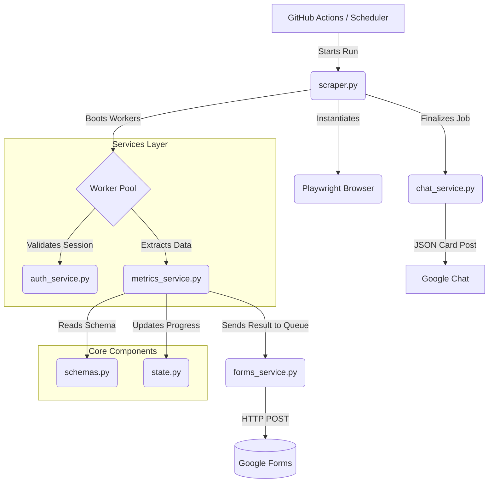

# Amazon 1MMS Dashboard Scraper


A robust, highly concurrent, headless Playwright scraper. It safely bypasses Amazon's Google Workspace login restrictions to accurately aggregate store-level performance metrics (such as **Late Picks**, **UPH**, **Order Volume**, and **Cancellations**) directly from internal metric API endpoints and rendering UI panels, all without breaking on regional variation.

---

## 📌 Features

- **Pydantic Validation:** Employs strict, type-safe API schema parsing. If Amazon's `summationMetrics` JSON payloads change unexpectedly, the system fails fast logically rather than submitting corrupted 0.0 values.
- **Fast-Path API Interception:** Skips slow UI rendering entirely for cached stores, directly pulling HTTP JSON metrics for maximum speed.
- **Auto-Scaling Concurrency:** Automatically measures system CPU and Memory usage to dynamically scale worker counts up or down (between 1 and 40+), ensuring maximum throughput without crashing GitHub Actions instances.
- **Google Chat Webhooks:** Dynamically engineers summary cards detailing the job execution, throughput, and error tracing directly into your Workspace Chat.
- **Safe State Recovery:** Safely persists Playwright auth states (cookies) and Merchant ID discovery caches between runs, preventing repeated login friction or CAPTCHA triggers.

---

## 🏗️ System Architecture

The application has been overhauled for extreme maintainability, strictly following a core-services separation.



### Component Breakdown

- `scraper.py` — The primary orchestrator. Bootstraps Chromium, creates the async workload pool, dynamically loads URLs, and waits for successful completion.
- `core/config.py` — Defines configuration schemas (using `pydantic-settings`). Exits loudly if critical environment variables are missing.
- `core/logger.py` — Handles rotating local file logging and automatic timezone localization (Europe/London).
- `core/state.py` — A thread-safe container storing queue lengths, error messages, and dynamic state caches without utilizing unprotected globals.
- `core/schemas.py` — Extremely strict `pydantic` models for mapping Amazon's HTTP JSON.
- `services/auth_service.py` — Encapsulates the Google Bypass, email/password entry, and 1MMS Merchant picker selection loop.
- `services/metrics_service.py` — Injects Amazon's internal APIs natively. Intercepts dashboard data or forces UI refreshes for target data collection iteratively.
- `services/forms_service.py` — Transforms normalized metric objects and pushes POST requests to the downstream Google Forms spreadsheet hook asynchronously.
- `services/chat_service.py` — Orchestrates dynamic Google Workspace Chat Cards.

---

## 🚀 Setting Up Locally

You do not need to use `config.json` manually anymore; configuration has been migrated to standard environment variables.

1. **Install Requirements:**
   ```bash
   pip install -r requirements.txt
   ```
2. **Install Playwright Browsers:**
   ```bash
   playwright install chromium
   ```
3. **Configure Environment Variables:**
   Create your environment configuration based on the example.
   ```bash
   cp .env.example .env
   ```
   Open `.env` and fill out your Amazon credentials, target URLs, and Webhook IDs.
4. **Execute:**
   ```bash
   python scraper.py
   ```

---

## ⚙️ Environment Variables Reference

| Variable | Description | Default |
| --- | --- | --- |
| `DEBUG` | Runs Playwright in headed mode (visible browser) if `true`. | `false` |
| `LOGIN_EMAIL` | The Email address for the Amazon Account. | *Required* |
| `LOGIN_PASSWORD` | The Password for the Amazon Account. | *Required* |
| `OTP_SECRET_KEY` | PyOTP Generator secret to bypass Authenticator challenges. | *Required* |
| `TARGET_URL` | The initial metric dashboard Playwright targets. | *Required* |
| `CHAT_WEBHOOK_URL` | Google Chat Space Hook endpoint. | *Required* |
| `INITIAL_CONCURRENCY` | Starting amount of workers for the pool. | `30` |
| `NUM_FORM_SUBMITTERS` | Thread boundaries for the Google Form submitting loop. | `2` |

---

## 🛠 Development & Code Quality

This project enforces `ruff` logic for maintaining highly readable, pristine code architectures.

**Before pushing changes** to this repository, ensure your code matches style semantics by verifying it locally:
```bash
ruff check .
ruff format .
```
The automated CI checks in GitHub Actions perform lint validations natively and will abort bad formatting requests before wasting Playwright run cycles.

---

## 🔄 GitHub Actions Workflows

This system is automatically scheduled natively inside `.github/workflows/run-scraper.yml`.

The execution lifecycle consists of:
1. `check-time`: A bash-script validating the current hour against `UK_TARGET_HOURS` to prevent off-hour spam.
2. `lint-code`: Verifies the code hasn't been improperly written.
3. `scrape-and-submit`: Collects variables safely masked within the Github Secrets repository and maps them automatically onto the `scraper.py` execution via native execution wrappers.

The persistent state (like login cookie sessions and mid-discovery arrays) rotates across GitHub Artifacts automatically, retaining authentication history spanning multiple days.
